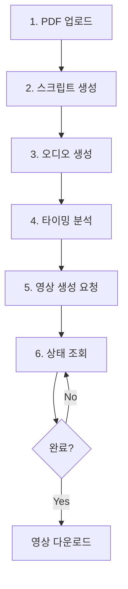

# Presentation API 사용 가이드

PDF 업로드부터 영상 생성까지 전체 프리젠테이션 워크플로우를 제공하는 API

---

## 목차

1. [API 엔드포인트 개요](#api-엔드포인트-개요)
2. [워크플로우](#워크플로우)
3. [엔드포인트 상세](#엔드포인트-상세)
4. [cURL 예제](#curl-예제)
5. [Python 예제](#python-예제)
6. [에러 처리](#에러-처리)

---

## API 엔드포인트 개요

총 **7개** 엔드포인트:

| 순서 | 메서드 | 엔드포인트 | 설명 |
|------|--------|-----------|------|
| 1 | POST | `/api/v1/presentations/upload` | PDF 업로드 및 처리 |
| 2 | POST | `/api/v1/presentations/{id}/generate-script` | 나레이션 스크립트 생성 |
| 3 | POST | `/api/v1/presentations/{id}/generate-audio` | TTS 오디오 생성 |
| 4 | POST | `/api/v1/presentations/{id}/analyze-timing` | 슬라이드 타이밍 분석 |
| 5 | POST | `/api/v1/presentations/{id}/generate-video` | 영상 생성 (비동기) |
| 6 | GET | `/api/v1/presentations/{id}` | 프리젠테이션 상세 조회 |
| 7 | GET | `/api/v1/presentations/projects/{project_id}/presentations` | 목록 조회 |

---

## 워크플로우



---

## 엔드포인트 상세

### 1. PDF 업로드

**`POST /api/v1/presentations/upload`**

PDF 파일을 업로드하고 개별 슬라이드 이미지로 변환합니다.

**요청 (multipart/form-data)**:
```json
{
  "file": "(PDF 파일)",
  "project_id": "proj_abc123",
  "dpi": 200,
  "lang": "kor+eng"
}
```

**응답**:
```json
{
  "presentation_id": "pres_xyz789",
  "pdf_path": "/uploads/pdfs/proj_abc123_1675248000_12ab34cd.pdf",
  "total_slides": 10,
  "slides": [
    {
      "slide_number": 1,
      "image_path": "/outputs/slides/slide_1675248000_12ab34cd_001.png",
      "ocr_text": null
    }
  ],
  "status": "uploaded",
  "created_at": "2026-02-02T10:00:00Z"
}
```

---

### 2. 스크립트 생성

**`POST /api/v1/presentations/{presentation_id}/generate-script`**

슬라이드 이미지로부터 나레이션 스크립트를 생성합니다.

**요청**:
```json
{
  "tone": "professional",
  "target_duration_per_slide": 15.0,
  "include_slide_numbers": false
}
```

**tone 옵션**:
- `professional`: 전문적이고 격식 있는 톤
- `friendly`: 친근하고 대화하는 톤
- `educational`: 교육적이고 설명적인 톤

**응답**:
```json
{
  "presentation_id": "pres_xyz789",
  "full_script": "안녕하세요, 오늘은 AI 기술의 발전에 대해 말씀드리겠습니다...",
  "slides": [
    {
      "slide_number": 1,
      "image_path": "/outputs/slides/slide_001.png",
      "script": "안녕하세요, 오늘은...",
      "duration": 12.5
    }
  ],
  "estimated_total_duration": 125.0,
  "status": "script_generated"
}
```

---

### 3. 오디오 생성

**`POST /api/v1/presentations/{presentation_id}/generate-audio`**

TTS로 나레이션 오디오를 생성하고 Whisper STT로 검증합니다.

**요청**:
```json
{
  "voice_id": "alloy",
  "script": null,
  "model": "tts-1"
}
```

**voice_id 옵션** (OpenAI TTS):
- `alloy`: 중성적
- `echo`: 남성
- `fable`: 영국식
- `onyx`: 남성, 깊은 목소리
- `nova`: 여성
- `shimmer`: 여성, 부드러움

**응답**:
```json
{
  "presentation_id": "pres_xyz789",
  "audio_path": "/outputs/audio/pres_xyz789.mp3",
  "duration": 123.5,
  "whisper_result": {
    "text": "안녕하세요, 오늘은...",
    "language": "ko",
    "duration": 123.5,
    "segments": [...]
  },
  "accuracy": 0.98,
  "status": "audio_generated"
}
```

---

### 4. 타이밍 분석

**`POST /api/v1/presentations/{presentation_id}/analyze-timing`**

Whisper 타임스탬프를 분석하여 슬라이드별 타이밍을 자동 매칭합니다.

**요청**:
```json
{
  "audio_path": null,
  "manual_timings": null
}
```

**manual_timings 예시** (자동 분석 대신 수동 설정):
```json
{
  "manual_timings": [10.0, 12.5, 15.0, 8.5, 20.0]
}
```

**응답**:
```json
{
  "presentation_id": "pres_xyz789",
  "slides": [
    {
      "slide_number": 1,
      "image_path": "/outputs/slides/slide_001.png",
      "script": "안녕하세요...",
      "start_time": 0.0,
      "end_time": 10.0,
      "duration": 10.0
    },
    {
      "slide_number": 2,
      "start_time": 10.0,
      "end_time": 22.5,
      "duration": 12.5
    }
  ],
  "total_duration": 123.5,
  "status": "timing_analyzed"
}
```

---

### 5. 영상 생성

**`POST /api/v1/presentations/{presentation_id}/generate-video`**

프리젠테이션 영상을 생성합니다 (비동기 처리).

**요청**:
```json
{
  "transition_effect": "fade",
  "transition_duration": 0.5,
  "bgm_path": "/path/to/bgm.mp3",
  "bgm_volume": 0.3
}
```

**transition_effect 옵션**:
- `fade`: 페이드 전환
- `slide`: 슬라이드 전환
- `zoom`: 줌 전환
- `none`: 전환 효과 없음

**응답**:
```json
{
  "presentation_id": "pres_xyz789",
  "video_path": null,
  "celery_task_id": "abc123-def456",
  "status": "video_rendering",
  "estimated_completion_time": 60
}
```

---

### 6. 프리젠테이션 상세 조회

**`GET /api/v1/presentations/{presentation_id}`**

프리젠테이션의 전체 정보를 조회합니다.

**응답**:
```json
{
  "presentation_id": "pres_xyz789",
  "project_id": "proj_abc123",
  "pdf_path": "/uploads/pdfs/...",
  "total_slides": 10,
  "slides": [...],
  "full_script": "안녕하세요...",
  "audio_path": "/outputs/audio/pres_xyz789.mp3",
  "video_path": "/outputs/videos/pres_xyz789.mp4",
  "status": "video_ready",
  "created_at": "2026-02-02T10:00:00Z",
  "updated_at": "2026-02-02T10:05:30Z",
  "metadata": {}
}
```

**status 값**:
- `uploaded`: PDF 업로드 완료
- `script_generated`: 스크립트 생성 완료
- `audio_generated`: 오디오 생성 완료
- `timing_analyzed`: 타이밍 분석 완료
- `video_rendering`: 영상 렌더링 중
- `video_ready`: 영상 생성 완료
- `failed`: 실패

---

### 7. 프리젠테이션 목록 조회

**`GET /api/v1/presentations/projects/{project_id}/presentations`**

프로젝트의 모든 프리젠테이션을 조회합니다.

**쿼리 파라미터**:
- `page`: 페이지 번호 (기본값: 1)
- `page_size`: 페이지 크기 (기본값: 20)

**응답**:
```json
{
  "presentations": [
    {
      "presentation_id": "pres_xyz789",
      "project_id": "proj_abc123",
      "total_slides": 10,
      "status": "video_ready",
      "created_at": "2026-02-02T10:00:00Z",
      "updated_at": "2026-02-02T10:05:30Z",
      "thumbnail_url": "/outputs/slides/slide_001.png"
    }
  ],
  "total": 5,
  "page": 1,
  "page_size": 20
}
```

---

## cURL 예제

### 1. PDF 업로드

```bash
curl -X POST "http://localhost:8000/api/v1/presentations/upload" \
  -F "file=@./presentation.pdf" \
  -F "project_id=proj_abc123" \
  -F "dpi=200" \
  -F "lang=kor+eng"
```

### 2. 스크립트 생성

```bash
curl -X POST "http://localhost:8000/api/v1/presentations/pres_xyz789/generate-script" \
  -H "Content-Type: application/json" \
  -d '{
    "tone": "professional",
    "target_duration_per_slide": 15.0,
    "include_slide_numbers": false
  }'
```

### 3. 오디오 생성

```bash
curl -X POST "http://localhost:8000/api/v1/presentations/pres_xyz789/generate-audio" \
  -H "Content-Type: application/json" \
  -d '{
    "voice_id": "alloy",
    "model": "tts-1"
  }'
```

### 4. 타이밍 분석

```bash
curl -X POST "http://localhost:8000/api/v1/presentations/pres_xyz789/analyze-timing" \
  -H "Content-Type: application/json" \
  -d '{}'
```

### 5. 영상 생성

```bash
curl -X POST "http://localhost:8000/api/v1/presentations/pres_xyz789/generate-video" \
  -H "Content-Type: application/json" \
  -d '{
    "transition_effect": "fade",
    "transition_duration": 0.5,
    "bgm_path": null,
    "bgm_volume": 0.3
  }'
```

### 6. 상세 조회

```bash
curl -X GET "http://localhost:8000/api/v1/presentations/pres_xyz789"
```

### 7. 목록 조회

```bash
curl -X GET "http://localhost:8000/api/v1/presentations/projects/proj_abc123/presentations?page=1&page_size=10"
```

---

## Python 예제

### 전체 워크플로우 (httpx 사용)

```python
import httpx
import asyncio

async def create_presentation():
    async with httpx.AsyncClient(timeout=300.0) as client:
        # 1. PDF 업로드
        with open("presentation.pdf", "rb") as f:
            response = await client.post(
                "http://localhost:8000/api/v1/presentations/upload",
                files={"file": ("presentation.pdf", f, "application/pdf")},
                data={
                    "project_id": "proj_abc123",
                    "dpi": 200,
                    "lang": "kor+eng"
                }
            )

        result = response.json()
        presentation_id = result["presentation_id"]
        print(f"Presentation ID: {presentation_id}")

        # 2. 스크립트 생성
        response = await client.post(
            f"http://localhost:8000/api/v1/presentations/{presentation_id}/generate-script",
            json={
                "tone": "professional",
                "target_duration_per_slide": 15.0
            }
        )
        print(f"Script generated: {response.json()['estimated_total_duration']}s")

        # 3. 오디오 생성
        response = await client.post(
            f"http://localhost:8000/api/v1/presentations/{presentation_id}/generate-audio",
            json={"voice_id": "alloy", "model": "tts-1"}
        )
        print(f"Audio generated: {response.json()['duration']}s")

        # 4. 타이밍 분석
        response = await client.post(
            f"http://localhost:8000/api/v1/presentations/{presentation_id}/analyze-timing",
            json={}
        )
        print(f"Timing analyzed: {response.json()['total_duration']}s")

        # 5. 영상 생성
        response = await client.post(
            f"http://localhost:8000/api/v1/presentations/{presentation_id}/generate-video",
            json={
                "transition_effect": "fade",
                "transition_duration": 0.5
            }
        )
        task_id = response.json()["celery_task_id"]
        print(f"Video generation started: {task_id}")

        # 6. 상태 폴링
        while True:
            response = await client.get(
                f"http://localhost:8000/api/v1/presentations/{presentation_id}"
            )
            detail = response.json()

            if detail["status"] == "video_ready":
                print(f"Video ready: {detail['video_path']}")
                break
            elif detail["status"] == "failed":
                print("Video generation failed")
                break

            await asyncio.sleep(5)

asyncio.run(create_presentation())
```

---

## 에러 처리

### 일반적인 에러 응답

```json
{
  "detail": "Presentation not found"
}
```

### HTTP 상태 코드

| 코드 | 의미 |
|------|------|
| 200 | 성공 |
| 400 | 잘못된 요청 (필수 필드 누락, 스크립트 미생성 등) |
| 404 | 프리젠테이션을 찾을 수 없음 |
| 500 | 서버 내부 오류 (FFmpeg 실패, TTS 실패 등) |

### 재시도 로직

영상 생성 실패 시 Celery가 자동으로 최대 **3회** 재시도합니다.

---

## 주의사항

1. **FFmpeg 설치 필요**: 영상 생성을 위해 FFmpeg가 시스템에 설치되어 있어야 합니다.
   ```bash
   # macOS
   brew install ffmpeg

   # Ubuntu
   apt install ffmpeg
   ```

2. **Celery Worker 실행**: 영상 생성은 비동기로 처리되므로 Celery worker가 실행 중이어야 합니다.
   ```bash
   celery -A app.tasks.celery_app worker --loglevel=info
   ```

3. **파일 크기 제한**: PDF 파일은 최대 100MB까지 업로드 가능합니다 (FastAPI 설정 변경 가능).

4. **타임아웃**: 영상 생성은 슬라이드 수에 따라 시간이 오래 걸릴 수 있습니다 (약 슬라이드당 5초).

---

## 문의

- **GitHub Issues**: [프로젝트 저장소](https://github.com/yourusername/omnivibe-pro)
- **API 문서**: http://localhost:8000/docs (Swagger UI)
