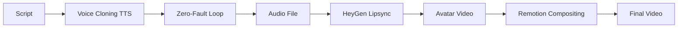

# Voice Cloning & Lipsync 고급 가이드

> **ElevenLabs + HeyGen 통합 가이드**

---

## 📋 Voice Cloning 고급 설정

### 1. 고품질 Voice Cloning

**최적 녹음 조건**:
- 시간: 3-5분 (권장)
- 샘플레이트: 44.1kHz 이상
- 비트레이트: 192kbps 이상
- 배경 노이즈: -60dB 이하
- 파일 형식: WAV 또는 FLAC

**녹음 팁**:
```
✅ DO:
- 조용한 환경에서 녹음
- 다양한 감정 표현 포함
- 자연스러운 속도로 말하기
- 문장 끝까지 명확하게 발음

❌ DON'T:
- 배경 음악 포함
- 너무 빠르거나 느리게
- 단조로운 톤만 사용
- 말더듬 또는 긴 침묵
```

### 2. Voice Settings 최적화

```python
# ElevenLabs Professional Voice Settings
voice_settings = {
    "stability": 0.75,  # 0-1 (높을수록 안정적)
    "similarity_boost": 0.85,  # 0-1 (높을수록 원본에 가까움)
    "style": 0.5,  # 0-1 (스타일 강도)
    "use_speaker_boost": True  # 화자 일관성 향상
}
```

**파라미터 설명**:
- **Stability**: 음성 안정성 (0.75 권장)
- **Similarity Boost**: 원본 음성 유사도 (0.85 권장)
- **Style**: 스타일 강도 (0.5 기본)
- **Speaker Boost**: 화자 일관성 (True 권장)

---

## 🎭 HeyGen Lipsync 통합

### 1. HeyGen API 설정

```python
# app/services/heygen_service.py
import httpx

class HeyGenService:
    def __init__(self):
        self.api_key = settings.HEYGEN_API_KEY
        self.endpoint = "https://api.heygen.com/v1"
    
    async def create_avatar_video(
        self,
        audio_url: str,
        avatar_id: str,
        background_url: Optional[str] = None
    ):
        """
        HeyGen Avatar 립싱크 영상 생성
        
        Args:
            audio_url: 오디오 파일 URL
            avatar_id: Avatar ID
            background_url: 배경 이미지/영상 URL
        """
        async with httpx.AsyncClient() as client:
            response = await client.post(
                f"{self.endpoint}/video.generate",
                headers={"X-Api-Key": self.api_key},
                json={
                    "audio_url": audio_url,
                    "avatar_id": avatar_id,
                    "background": {
                        "type": "image",
                        "url": background_url
                    },
                    "ratio": "16:9",
                    "resolution": "1080p"
                }
            )
            return response.json()
```

### 2. Avatar 생성

```python
async def upload_avatar_image(self, image_url: str):
    """
    사용자 이미지로 Avatar 생성
    
    Returns:
        avatar_id: 생성된 Avatar ID
    """
    async with httpx.AsyncClient() as client:
        response = await client.post(
            f"{self.endpoint}/avatar.create",
            headers={"X-Api-Key": self.api_key},
            json={
                "image_url": image_url,
                "name": "Custom Avatar",
                "gender": "male"  # or "female"
            }
        )
        return response.json()["avatar_id"]
```

---

## 🎬 전체 워크플로우

### Script → Voice → Lipsync → Video



### 코드 예시

```python
@router.post("/api/v1/video/generate-with-lipsync")
async def generate_video_with_lipsync(
    script: str,
    voice_id: str,
    avatar_id: str
):
    # 1. Voice Cloning TTS
    audio_result = await audio_loop.generate_verified_audio(
        text=script,
        voice_id=voice_id
    )
    
    # 2. HeyGen Lipsync
    heygen = HeyGenService()
    lipsync_result = await heygen.create_avatar_video(
        audio_url=audio_result["audio_url"],
        avatar_id=avatar_id
    )
    
    # 3. Remotion Compositing
    remotion = RemotionService()
    final_video = await remotion.render_with_avatar(
        lipsync_video_url=lipsync_result["video_url"],
        storyboard_blocks=blocks
    )
    
    return {
        "video_url": final_video["url"],
        "duration": final_video["duration"]
    }
```

---

## 💰 비용 최적화

### ElevenLabs 비용

| Plan | Price | Characters/month |
|------|-------|------------------|
| Free | $0 | 10,000 |
| Starter | $5 | 30,000 |
| Creator | $22 | 100,000 |
| Professional | $99 | 500,000 |

**최적화 팁**:
- 캐싱 활용 (동일 텍스트 재사용)
- Batch 처리 (한 번에 여러 문장)
- 짧은 Haiku 모델 사용

### HeyGen 비용

| Plan | Price | Credits/month |
|------|-------|---------------|
| Free | $0 | 1 min |
| Essential | $29 | 15 min |
| Business | $89 | 90 min |
| Enterprise | Custom | Unlimited |

**1분 영상 = 1 Credit**

---

**Last Updated**: 2026-02-08
