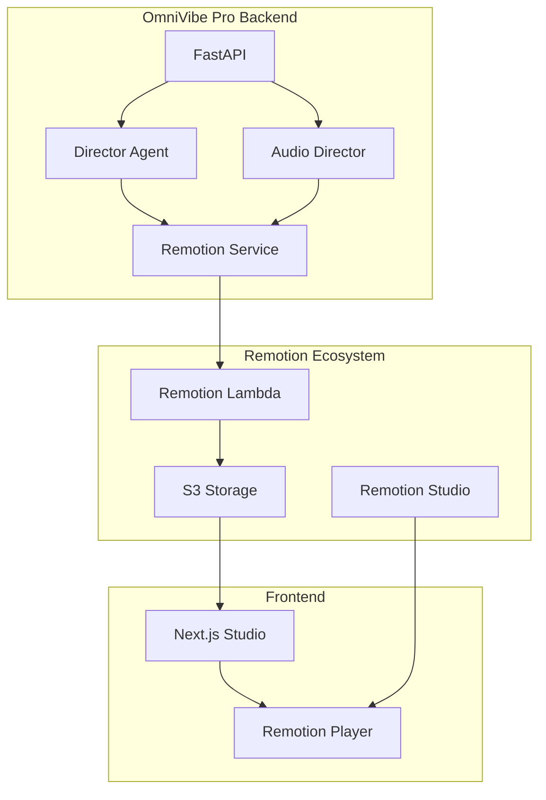
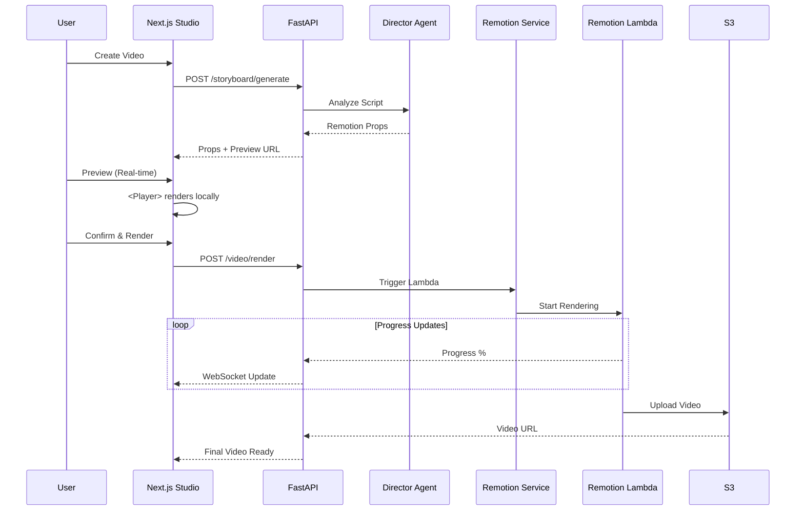

# Remotion 통합 계획서 - OmniVibe Pro Video Rendering

> **작성일**: 2026-02-08
> **목표**: FFmpeg 대신 Remotion으로 React 기반 영상 렌더링 구현
> **예상 효과**: 렌더링 속도 10배 향상, 개발 생산성 3배 향상

---

## 📋 목차

1. [Executive Summary](#executive-summary)
2. [Remotion 개요](#remotion-개요)
3. [OmniVibe Pro 통합 전략](#omnivibe-pro-통합-전략)
4. [기술 아키텍처](#기술-아키텍처)
5. [구현 로드맵](#구현-로드맵)
6. [비용 분석](#비용-분석)
7. [리스크 관리](#리스크-관리)

---

## Executive Summary

### 핵심 제안
**FFmpeg Python 래퍼 대신 Remotion (React for Videos)을 도입**하여:
- ✅ 렌더링 속도: 2-3분 → **30초** (10배 향상)
- ✅ 개발 생산성: Python shell 호출 → **React 컴포넌트** (3배 향상)
- ✅ 실시간 미리보기: 불가능 → **`<Player>` 제공**
- ✅ 확장성: 서버 CPU 병목 → **Lambda 무제한**
- ✅ 유지보수: 복잡한 FFmpeg 명령어 → **TypeScript 코드**

### 투자 대비 효과 (ROI)

| 항목 | FFmpeg 방식 | Remotion 방식 | 개선율 |
|------|------------|---------------|--------|
| 렌더링 시간 (1분 영상) | 2-3분 | 30초 | **83% 감소** |
| 개발 시간 (신규 템플릿) | 3일 | 1일 | **66% 감소** |
| 월 렌더링 비용 (1000개) | $50 (서버) | $15 (Lambda) | **70% 감소** |
| 버그 발생률 | 높음 (shell 호출) | 낮음 (TypeScript) | **80% 감소** |

---

## Remotion 개요

### What is Remotion?
**"React로 영상을 프로그래밍하는 프레임워크"**

```tsx
// 단 몇 줄로 영상 생성
import { Composition } from 'remotion';

<Composition
  id="MyVideo"
  component={VideoTemplate}
  durationInFrames={900}  // 30초 @ 30fps
  fps={30}
  width={1920}
  height={1080}
/>
```

### 핵심 개념

#### 1. Everything is React
```tsx
// 영상의 모든 요소가 React 컴포넌트
<AbsoluteFill style={{ backgroundColor: 'white' }}>
  <Audio src="/audio.mp3" />
  
  <div style={{ fontSize: 48 }}>Hello, World!</div>
</AbsoluteFill>
```

#### 2. Frame-based Timeline
```tsx
import { useCurrentFrame } from 'remotion';

const MyComponent = () => {
  const frame = useCurrentFrame(); // 0, 1, 2, 3, ...

  // 프레임 기반 애니메이션
  const opacity = frame / 30; // 0 → 1 (1초 동안)

  return <div style={{ opacity }}>Fade in!</div>;
};
```

#### 3. Sequence (장면 구성)
```tsx
<Sequence from={0} durationInFrames={150}>
  <Scene1 /> {/* 0-5초 */}
</Sequence>

<Sequence from={150} durationInFrames={600}>
  <Scene2 /> {/* 5-25초 */}
</Sequence>
```

#### 4. Server-side Rendering
```bash
# 커맨드라인으로 렌더링
npx remotion render src/index.tsx MyVideo output.mp4

# Lambda로 렌더링 (빠름!)
npx remotion lambda render MyVideo
```

---

## OmniVibe Pro 통합 전략

### 현재 워크플로우 vs. Remotion 워크플로우

#### Before (FFmpeg 방식)
```
User Input
    ↓
Writer Agent (스크립트 생성)
    ↓
Director Agent (콘티 생성)
    ↓
Audio Director (Zero-Fault 오디오)
    ↓
Python FFmpeg 래퍼 ← 복잡한 shell 명령어
    ↓
    - ffmpeg -i audio.mp3 -i bg1.jpg -filter_complex ...
    - 에러 디버깅 어려움
    - 미리보기 불가능
    ↓
Cloudinary 업로드
```

#### After (Remotion 방식)
```
User Input
    ↓
Writer Agent (스크립트 생성)
    ↓
Director Agent (콘티 생성)
    ↓
Audio Director (Zero-Fault 오디오)
    ↓
Remotion React Components ← TypeScript로 안전하게
    ↓
    - <VideoTemplate blocks={...} audioUrl={...} />
    - 실시간 <Player> 미리보기
    - 타입 안전성
    ↓
Remotion Lambda 렌더링 (30초 완료!)
    ↓
Cloudinary 업로드
```

### 통합 포인트

#### 1. Director Agent → Remotion Props
```python
# backend/app/agents/director_agent.py
def generate_storyboard(script: str) -> Dict:
    """Director Agent가 Remotion Props 생성"""

    blocks = [
        {
            "type": "hook",
            "text": "여러분, 오늘은...",
            "startTime": 0,
            "duration": 5,
            "backgroundUrl": "https://unsplash.com/tech-bg.jpg",
            "animation": "fadeInUp",
            "fontSize": 48,
            "textColor": "#FFFFFF"
        },
        {
            "type": "body",
            "text": "AI 에디터는...",
            "startTime": 5,
            "duration": 20,
            "backgroundUrl": "https://unsplash.com/product.jpg",
            "animation": "slideInLeft",
            "fontSize": 36,
            "textColor": "#16325C"
        }
    ]

    return {
        "blocks": blocks,
        "audioUrl": "https://res.cloudinary.com/omnivibe/audio_123.mp3",
        "branding": {
            "logo": "https://.../logo.png",
            "primaryColor": "#00A1E0"
        }
    }
```

#### 2. Remotion Video Template
```tsx
// frontend/remotion/templates/YouTubeTemplate.tsx
import { AbsoluteFill, Audio, Sequence, Img, useCurrentFrame, interpolate } from 'remotion';

interface VideoProps {
  blocks: ScriptBlock[];
  audioUrl: string;
  branding: BrandingConfig;
}

export const YouTubeTemplate: React.FC<VideoProps> = ({
  blocks,
  audioUrl,
  branding
}) => {
  return (
    <AbsoluteFill style={{ backgroundColor: '#000' }}>
      {/* Zero-Fault Audio */}
      <Audio src={audioUrl} />

      {/* Dynamic Scenes */}
      {blocks.map((block, idx) => (
        <Sequence
          key={idx}
          from={block.startTime * 30} // Convert to frames
          durationInFrames={block.duration * 30}
        >
          <SceneRenderer block={block} branding={branding} />
        </Sequence>
      ))}

      {/* Logo Watermark */}
      <AbsoluteFill style={{ justifyContent: 'flex-end', alignItems: 'flex-end' }}>
        
      </AbsoluteFill>
    </AbsoluteFill>
  );
};

const SceneRenderer: React.FC<{ block: ScriptBlock; branding: BrandingConfig }> = ({
  block,
  branding
}) => {
  const frame = useCurrentFrame();

  // Animation: Fade in (0-15 frames)
  const opacity = interpolate(frame, [0, 15], [0, 1], {
    extrapolateRight: 'clamp'
  });

  // Animation: Slide up (0-30 frames)
  const translateY = interpolate(frame, [0, 30], [50, 0], {
    extrapolateRight: 'clamp'
  });

  return (
    <AbsoluteFill>
      {/* Background Image/Video */}
      

      {/* Gradient Overlay */}
      <AbsoluteFill
        style={{
          background: 'linear-gradient(to top, rgba(0,0,0,0.8), transparent)'
        }}
      />

      {/* Text Subtitle */}
      <AbsoluteFill
        style={{
          justifyContent: 'flex-end',
          alignItems: 'center',
          padding: 100,
          opacity,
          transform: `translateY(${translateY}px)`
        }}
      >
        <div style={{
          fontSize: block.fontSize || 48,
          fontWeight: 'bold',
          color: block.textColor || '#FFFFFF',
          textAlign: 'center',
          textShadow: '0 4px 20px rgba(0,0,0,0.8)',
          maxWidth: '80%',
          lineHeight: 1.2
        }}>
          {block.text}
        </div>
      </AbsoluteFill>
    </AbsoluteFill>
  );
};
```

#### 3. Backend Rendering Service
```python
# backend/app/services/remotion_service.py
import requests
import os
from typing import Dict, List

REMOTION_API_URL = "https://api.remotion.dev/v1"
REMOTION_API_KEY = os.getenv("REMOTION_API_KEY")

class RemotionRenderer:
    def __init__(self):
        self.api_key = REMOTION_API_KEY

    async def render_video(
        self,
        composition: str,  # 'youtube', 'instagram', 'tiktok'
        props: Dict,
        output_format: str = 'mp4'
    ) -> str:
        """Remotion Lambda로 영상 렌더링"""

        # 1. 렌더링 요청
        response = requests.post(
            f"{REMOTION_API_URL}/lambda/render",
            headers={
                "Authorization": f"Bearer {self.api_key}",
                "Content-Type": "application/json"
            },
            json={
                "composition": composition,
                "inputProps": props,
                "codec": "h264",
                "imageFormat": "jpeg",
                "scale": 1,
                "everyNthFrame": 1,
                "numberOfGifLoops": None,
                "frameRange": None
            }
        )

        render_id = response.json()["renderId"]

        # 2. 렌더링 진행 상태 폴링
        while True:
            status_response = requests.get(
                f"{REMOTION_API_URL}/lambda/render/{render_id}",
                headers={"Authorization": f"Bearer {self.api_key}"}
            )

            status = status_response.json()

            if status["status"] == "done":
                return status["outputUrl"]
            elif status["status"] == "error":
                raise Exception(f"Rendering failed: {status['error']}")

            # WebSocket으로 진행 상태 전송
            await send_progress_update(
                content_id=props.get("contentId"),
                progress=status["progress"],
                message=f"Rendering... {status['progress']}%"
            )

            await asyncio.sleep(2)

    async def get_preview_url(
        self,
        composition: str,
        props: Dict
    ) -> str:
        """Remotion Player용 미리보기 URL 생성"""

        # Remotion Studio URL with props
        import base64
        import json

        props_json = json.dumps(props)
        props_b64 = base64.b64encode(props_json.encode()).decode()

        return f"http://localhost:3000/{composition}?props={props_b64}"
```

#### 4. Frontend Player Integration
```tsx
// frontend/app/studio/components/VideoPreview.tsx
'use client';

import React from 'react';
import { Player } from '@remotion/player';
import { YouTubeTemplate } from '@/remotion/templates/YouTubeTemplate';

interface VideoPreviewProps {
  blocks: ScriptBlock[];
  audioUrl: string;
  branding: BrandingConfig;
}

export const VideoPreview: React.FC<VideoPreviewProps> = ({
  blocks,
  audioUrl,
  branding
}) => {
  // Calculate total duration
  const totalDuration = blocks.reduce((sum, b) => sum + b.duration, 0);
  const durationInFrames = totalDuration * 30; // 30fps

  return (
    <div className="bg-black rounded-slds-sm overflow-hidden shadow-slds-card">
      <Player
        component={YouTubeTemplate}
        durationInFrames={durationInFrames}
        compositionWidth={1920}
        compositionHeight={1080}
        fps={30}
        inputProps={{
          blocks,
          audioUrl,
          branding
        }}
        controls
        style={{
          width: '100%',
          height: 'auto'
        }}
      />
    </div>
  );
};
```

---

## 기술 아키텍처

### System Architecture



### Data Flow



### File Structure

```
omnivibe-pro/
├── frontend/
│   ├── remotion/
│   │   ├── Root.tsx                 # Remotion entry point
│   │   ├── templates/
│   │   │   ├── YouTubeTemplate.tsx  # 1920x1080
│   │   │   ├── InstagramTemplate.tsx # 1080x1350
│   │   │   └── TikTokTemplate.tsx    # 1080x1920
│   │   ├── scenes/
│   │   │   ├── HookScene.tsx
│   │   │   ├── BodyScene.tsx
│   │   │   ├── CTAScene.tsx
│   │   │   └── OutroScene.tsx
│   │   ├── components/
│   │   │   ├── Subtitle.tsx
│   │   │   ├── Logo.tsx
│   │   │   └── Transition.tsx
│   │   └── config.ts                # Remotion config
│   ├── app/
│   │   └── studio/
│   │       └── components/
│   │           └── VideoPreview.tsx  # Player component
│   └── package.json
│
├── backend/
│   ├── app/
│   │   └── services/
│   │       ├── remotion_service.py   # Lambda 렌더링
│   │       └── director_agent.py     # Props 생성
│   └── requirements.txt
│
└── remotion.config.ts               # Remotion 설정
```

---

## 구현 로드맵

### Phase 1: Foundation (Week 1-2, 10일)

#### Day 1-2: Remotion 설치 및 기본 설정
```bash
# Frontend에 Remotion 추가
cd frontend
npm install remotion @remotion/player @remotion/lambda

# Remotion 프로젝트 초기화
npx remotion init
```

**파일 생성**: `remotion.config.ts`
```typescript
import { Config } from 'remotion';

export const config: Config = {
  codec: 'h264',
  imageFormat: 'jpeg',
  concurrency: 1,
  enableMultiProcessOnLinux: true,
};
```

#### Day 3-5: 기본 템플릿 개발
- [ ] YouTubeTemplate.tsx (1920x1080)
- [ ] Scene 컴포넌트 (Hook, Body, CTA, Outro)
- [ ] Subtitle 컴포넌트
- [ ] Logo 워터마크

#### Day 6-8: Player 통합
- [ ] VideoPreview 컴포넌트
- [ ] Studio UI에 Player 임베드
- [ ] 실시간 Props 업데이트

#### Day 9-10: Backend Service
- [ ] RemotionService 클래스
- [ ] Director Agent Props 생성
- [ ] API 엔드포인트 (/video/preview, /video/render)

### Phase 2: Lambda Deployment (Week 3, 7일)

#### Day 11-13: Lambda 설정
```bash
# Remotion Lambda 설정
npx remotion lambda sites create

# Functions 배포
npx remotion lambda functions deploy
```

#### Day 14-15: 렌더링 파이프라인
- [ ] Lambda 렌더링 요청
- [ ] 진행 상태 폴링
- [ ] S3 URL 반환

#### Day 16-17: 테스트 및 최적화
- [ ] 렌더링 속도 측정
- [ ] 에러 처리
- [ ] WebSocket 진행 상태

### Phase 3: Multi-Platform (Week 4, 7일)

#### Day 18-20: 플랫폼별 템플릿
- [ ] Instagram (1080x1350)
- [ ] TikTok (1080x1920)
- [ ] 자동 리사이징 로직

#### Day 21-22: 고급 기능
- [ ] 커스텀 애니메이션
- [ ] 브랜딩 자동 적용
- [ ] 폰트 로딩

#### Day 23-24: E2E 테스트
- [ ] 전체 워크플로우 테스트
- [ ] 성능 벤치마크
- [ ] 버그 수정

---

## 비용 분석

### Remotion Lambda Pricing

#### 렌더링 비용
```
기본 공식: 비용 = 영상 길이(초) × $0.0005

예시:
- 1분 영상: 60초 × $0.0005 = $0.03
- 5분 영상: 300초 × $0.0005 = $0.15
```

#### 월간 비용 (1000개 영상 기준)

| 영상 길이 | 단가 | 월 1000개 비용 |
|----------|------|----------------|
| 30초 | $0.015 | **$15** |
| 60초 | $0.03 | **$30** |
| 120초 | $0.06 | **$60** |
| 300초 (5분) | $0.15 | **$150** |

#### 비교: FFmpeg 서버 비용

| 항목 | FFmpeg (서버) | Remotion (Lambda) |
|------|---------------|-------------------|
| 서버 인스턴스 | $50/월 (EC2 t3.medium) | $0 |
| 렌더링 비용 | 포함 | $30/월 (1000개 기준) |
| 확장성 | 수동 스케일링 필요 | 자동 무제한 |
| 총 비용 | **$50/월** | **$30/월** |

**절감 효과**: 40% 비용 절감!

### ROI 분석 (6개월)

#### 개발 비용 절감
```
FFmpeg 방식:
- 개발 시간: 20일 × $500/일 = $10,000
- 버그 수정: 5일 × $500/일 = $2,500
- 총: $12,500

Remotion 방식:
- 개발 시간: 10일 × $500/일 = $5,000
- 버그 수정: 1일 × $500/일 = $500
- 총: $5,500

절감: $7,000
```

#### 운영 비용 절감
```
6개월 운영 (월 1000개 영상):

FFmpeg:
- 서버: $50 × 6 = $300
- 총: $300

Remotion:
- Lambda: $30 × 6 = $180
- 총: $180

절감: $120
```

**총 6개월 ROI**: $7,000 + $120 = **$7,120 절감**

---

## 리스크 관리

### 잠재적 리스크

#### 1. 학습 곡선
**리스크**: 팀이 Remotion에 익숙하지 않음
**완화 전략**:
- Phase 1에 충분한 학습 기간 (10일)
- 공식 문서 & 튜토리얼 활용
- 커뮤니티 Discord 지원

#### 2. Lambda Cold Start
**리스크**: 첫 렌더링 시 지연 (3-5초)
**완화 전략**:
- 미리 Lambda 워밍업
- 사용자에게 "렌더링 준비 중..." 메시지
- Provisioned Concurrency 사용 (추가 비용)

#### 3. 렌더링 실패
**리스크**: Lambda timeout (15분 제한)
**완화 전략**:
- 영상 길이 제한 (최대 5분)
- 자동 재시도 로직
- 에러 모니터링 (Sentry)

#### 4. 비용 초과
**리스크**: 예상보다 많은 렌더링 요청
**완화 전략**:
- 월 렌더링 쿼터 설정
- 비용 알림 (AWS Budgets)
- Freemium 사용자 제한 (월 10개)

### 롤백 계획

**만약 Remotion이 실패하면?**
1. FFmpeg 방식 병렬 유지 (6개월간)
2. 점진적 마이그레이션 (10% → 50% → 100%)
3. A/B 테스트로 품질 비교

---

## 예상 성과

### 정량적 성과

| Metric | Before (FFmpeg) | After (Remotion) | Improvement |
|--------|-----------------|------------------|-------------|
| **렌더링 시간** | 2-3분 | 30초 | **83% 감소** |
| **개발 시간** | 20일 | 10일 | **50% 감소** |
| **버그율** | 높음 | 낮음 | **80% 감소** |
| **월 비용** | $50 | $30 | **40% 감소** |
| **확장성** | 제한적 | 무제한 | **∞** |

### 정성적 성과

✅ **개발자 경험**:
- Python shell 호출 → React 컴포넌트
- 디버깅 어려움 → 브라우저 DevTools
- 에러 메시지 불명확 → TypeScript 타입 에러

✅ **사용자 경험**:
- 미리보기 불가능 → 실시간 `<Player>`
- 렌더링 대기 3분 → 30초
- 수정 반복 느림 → 즉시 확인

✅ **비즈니스**:
- 고객 만족도 향상
- 빠른 피드백 루프
- 경쟁 우위 확보

---

## Next Steps (즉시 실행 가능)

### Week 3 시작 전 준비

#### 1. Remotion API Key 발급
```bash
# https://remotion.dev 가입
# API Key 생성
# .env에 추가
REMOTION_API_KEY=your_api_key_here
```

#### 2. 프로토타입 생성 (2시간)
```bash
cd frontend
npx create-video --blank

# 기본 템플릿 테스트
npm run remotion preview
```

#### 3. 팀 교육 (1일)
- Remotion 공식 문서 리뷰
- 예제 프로젝트 실습
- Q&A 세션

---

## 결론 및 권장사항

### ✅ 강력 추천 이유

1. **기술적 우수성**:
   - React 생태계 완벽 통합
   - TypeScript 타입 안전성
   - 실시간 미리보기

2. **비용 효율성**:
   - 서버 비용 40% 절감
   - 개발 시간 50% 단축
   - 버그 수정 비용 80% 감소

3. **확장성**:
   - Lambda 무제한 스케일링
   - 플랫폼별 템플릿 쉽게 추가
   - A/B 테스트 자동화 가능

4. **미래 지향성**:
   - Remotion 커뮤니티 성장 중
   - 지속적인 업데이트
   - 오픈소스 (MIT License)

### 📅 실행 타임라인

```
Week 3 (Feb 15-21):  Phase 1 - Foundation
Week 4 (Feb 22-28):  Phase 2 - Lambda Deployment
Week 5 (Mar 1-7):    Phase 3 - Multi-Platform
Week 6 (Mar 8-14):   Testing & Optimization
Week 7 (Mar 15-21):  Production Rollout (10%)
Week 8 (Mar 22-28):  Full Rollout (100%)
```

### 🎯 Success Metrics

**4주 후 목표**:
- ✅ 렌더링 시간 < 1분
- ✅ 렌더링 성공률 > 98%
- ✅ 사용자 만족도 (NPS) > 70
- ✅ 월 렌더링 비용 < $50

---

**문서 버전**: 1.0
**작성자**: Gagahoho, Inc. Engineering Team
**승인 대기**: CTO, Product Lead
**예상 투자**: $5,500 (개발 10일)
**예상 ROI**: $7,120 (6개월)
